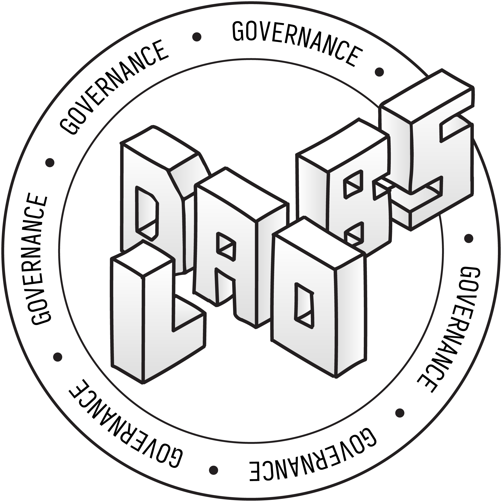

## DAOLABS/MovementDAO Documentation Site

<p align="center">
<br /><br />
Governance, Proposals, Specifications, Templates, Blog Posts and more.
</p>

[CHANGELOG](./CHANGELOG.md)

## TL;DR

```bash
yarn install && yarn run dev
```

## Introduction

The website's pages _(or articles)_ are automatically generated from a file structure adhering to:

```sh
- src/docs/
    - Category1 (Top level folder is the category)
        - _category_.json (json file with the category name and position)
        - README.md (optional index markdown file to show on click of a collapsible)
        - SubCategory1 (Sub level folder is the sub category)
            - _category_.json (json file with the sub category name and position)
            - file1.md (markdown file)
            - file2.md (markdown file)
        - SubCategory2 (Sub level folder is the sub category)
            - _category_.json (json file with the sub category name and position)
            - file1.md (markdown file)
            - file2.md (markdown file)
    - Category2
        ...

Generates a routes file for the app to create the main header and sidebar.
```

You may include `_ignore_` if you have a folder with referenced content that you do not what to show in the menu.

Markdown files which have a `json` file with the same name will be used to generate a form. The `md` and `json` files must contain matching variables for the form to be generated without incident. The `json` file may be omitted if you simply want to generate a page. Variables contained within the `md` and `json` files may also include type, label, value and placeholder. The type informs the presentation of the type of form element to generate, the label, value, and placeholder convey the type of information sought or to provide default values.

The site seeks to use a markdown document as the single source of truth which the user may convert into other formats as needed.

## Future updates

Future iterations of this tool will include persisting the form data, sharing filled out forms, and a robust `.docx` generator for the form output. Access to the tools, real-time chat support, and concierge service to collect information, provide non-legal help, or answer questions could be facilitated through requiring a Juicebox project NFT, creator NFT, minimum ETH balance, and web-application chat support.

## Background

Many ideas were borrowed from Docusaurus, however given Docusaurus is based on React, this project was build on SvelteKit, largely to appear ideological to @filipv. The project `prepares` the site by processing the `markdown` and `json` and generating a `docs.json` file which is used as the menu and heading structure for the site.

Running the preparation script in verbose mode will print out the `_category_.json` files and their position. While you may omit the `_category_.json` file, it is recommended to include it to ensure the correct order of the menu items. An explicit `_ignore_` file should be included so that the console warnings guide you.

Run the preparation script by using `ts-node --esm scripts/generateRoutes.ts -v`.

The leaf files will have the name of the markdown file capitalized and with '-/\_' substituted for space.

Optionally mix svelte and markdown `https://mdsvex.pngwn.io/docs/` in the doc files.

## Content

The purpose of the site is to provide documentation to users about DAOLABS entity, governance, and produce specification. Additionally, a wide variety of forms are provided which are consistently organized, formatted, and abstracted, which the site pre-processes to generate a form and a consistent user experience to review templates, the variables contained within, and the ability to update the form with their own information.

## Developing

Once you've installed dependencies with `yarn install`, start a development server:

```bash
yarn run dev

# or start the server and open the app in a new browser tab
yarn run dev -- --open
```

## Building

To create a production version of your app:

```bash
yarn run build
```

You can preview the production build with `yarn run preview`.

> To deploy your app, you may need to install an [adapter](https://kit.svelte.dev/docs/adapters) for your target environment.

## Pushing

Prior to pushing any proposed changes, please run `yarn run format && yarn run lint` to ensure that the code is formatted correctly.

## Tips

For wrongly formatted tables, try copying the table markdown into https://dillinger.io/, then copying the html into https://www.convertsimple.com/convert-html-to-markdown/, and then copying the resulting markdown back into the document.
